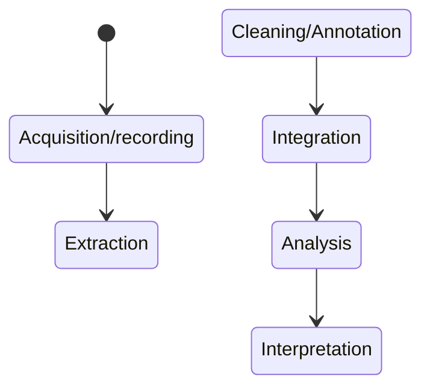

## About-bigdata
### Big Data With Examples and Types
1. Structured

2. Unstructured

3. Semi-structured

**_Structured_**

Data that has a set format for efficient access by both software and people is referred to as structured data. Typically, it is tabular with clearly defined rows and columns for data properties.

#### Examples

Tables, Relational Databases, XML, JSON

| Sno | Name | Age |
| --- | ---  | --- |
| 1   | John | 30  |
| 2   | Jane | 25  |
| 3   | Bob  | 35  |

**_Unstructured_**

Unstructured data, which includes emails, text messages, photos, videos, and audio files, is all the information that isn't predetermined and searchable in a table. Unstructured data cannot be immediately evaluated and searched without additional processing, in contrast to structured data, which can be easily inserted into tables like those available in Microsoft Excel.

#### Examples

Books, Journals, Documents, metadata, audio, videos

**_Semi-structured_**

The phrase "semi-structured data" (also known as "partially structured data") describes a class of data that does not follow the tabular structure present in relational databases or other types of data tables, but does have tags and metadata that separate semantic elements and create hierarchies of records and fields. 

#### Examples

Email

### 6 V's of Big Data

. Volume

. Velocity

. Variety

. Variability

. Veracity

. Value

**. Volume** 
     The volume of Big data is too large so that it is not capable of fitting in a particular  single machine, we define the volume of big data is vast and many specialized tools and frameworks are required to both store and visualize the process in the data

**. Velocity**
      Velocity in big data refers to the movement of the data that is created and used, data is being generated by very large sources of data hence the velocity of the data generated might be high, also certain sources of data highly produce rapid movements in data, consider the example of social media data, email data, etc

**. Variety**
     It represents the forms of data, we have three forms of data like :
     **_Structured_**
     **_Unstructured**
     **_Semi_structured**
         
**. Variability**
      There are certain cases of consistency and inconsistency in data, and the data will be inconsistent in certain cases, such cases need managing and handling with care. For example, social media data is highly sensitive and private it requires certain data management handling techniques whereas data produced by sensors will be inconsistent
      
**. Veracity**
     It refers to the quality of data and verifies whether the data is accurate or not. To get particular values from the data we need to clean the data set and remove the unnecessary part.
     
**. Value**
     Value is nothing but the usefulness of data for a particular purpose. The final goal might be the usage of any big data analytics system to extract valuable insights from the data.
     
## Phases of Big Data Analysis.

 **Acquisition/Recording**
 
  1. Data is generated from many sources like IoT/Sensors/Computing/Social media etc.
  2. Some data might not have a lot of importance and the important data can be filtered and compressed by some orders of magnitude
  3. Certain filters have to be designed for cleaning.
  4. Storing the right information when the data has been created or so
       . Example - Storing of pictures in devices

  **Extraction and Cleaning**

  1.**_Information extracting_** : Extracting the information from the sources and express it in a structural form
  2.**_Data Cleaning_** : Attempting to clean the data set , fill the null values and remove the noise values

  **Data Integration**

  1.**_Data Integration_** : Merging from multiple resources
  2.**_Data Representation_** : Using various techniques of visualization like plotting graphs suchs as charts,histogram,bar,boxplots etc

  **Data Analysis**

  1.**_Query Process_** :Query is a way to get useful data subsets by some process like abstract modellingand standardizing them to one another
        .Exammple - Data base modelling, semantic data modelling

  2.**_No SQL_** : Certain methods in big data and queries cannot only be done by SQL queries we have to use no sql in such cases

  **Interpretation**

  Interpreting the data and verifying te=he results produced by the computer, for interpreting the data visualizations help a lot, after the interpretation it is ready to make decision making 

  ### Challenges in big data 
  Following are the challenges in big data:
  1. Privacy
  2. Scaling
  3. Timeline
  4. Incompleteness
  5. Human Collaboration

     **Privacy**
     The biggest challenge that ever comes into mind is privacy concern, a lot of information is being observed and grasped by viewers on social media, this can be a present and future concern
     Big data in healthcare,lot of concern on privacy concern in health department since the information of patient keeping secretive is quite questionable
     All ethics and Privacy concerns must be known to every one in the big data field

     **Scaling**
     As the data increases and getting adopted to newer technologies is nothing but increasing the harddisk space!!
     And yeah data volume increases faster and scaling is neccessary, changing storage subsystem potentially touches every aspect of data processing too

     **Timeliness**
     All things have deadliness and analysis and descision making is quite important,if there involves a huge data set cleaning is must, one cannot skip the step and it takes much time to even clean the data.
     And some problems of cleaning data and searching the appropriate answer requires a huge time. There is a need for new index strctures that are need based on the features

     **Incompleteness**
     The ubiquitous problem of data sets lacking all the information necessary for thorough analysis or decision-making is referred to as the "big data incompleteness challenge." Big data frequently contains missing, 
     incorrect, or out-of-date data, which can result in imprecise insights and incorrect conclusions. To address this issue and improve data quality, advanced data cleaning and imputation approaches are required. It 
    also emphasizes the significance of data governance and validation procedures for reducing the influence of incomplete data on the accuracy and dependability of analytical results in the age of big data analytics.

